<div align="center">

# Consulta SIH/SUS

**Pergunte em português sobre 144 milhões de internações hospitalares do SUS.**

Três ferramentas sobre a mesma base: um **chat** que traduz a pergunta em SQL e
responde com gráfico; **temas** de investigação que acumulam evidência com
procedência; e **painéis** com filtros que recalculam tudo ao vivo — todos
construíveis em linguagem natural.


[Começar em 5 minutos](#começar-em-5-minutos) · [As três ferramentas](#as-três-ferramentas) · [Como funciona](#como-funciona) · [Avaliação](#avaliação) · [Limitações](#limitações-conhecidas)

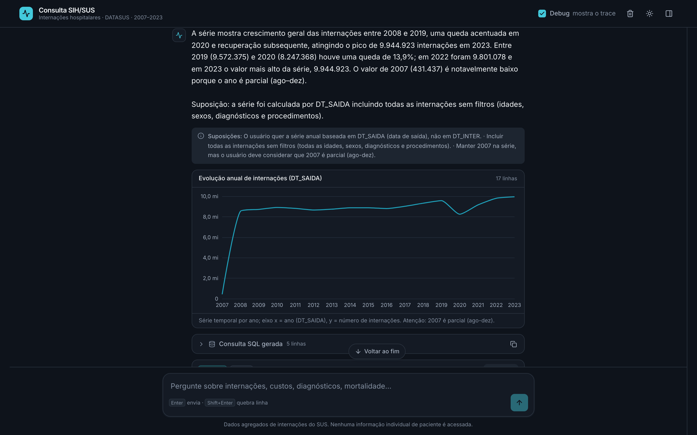

</div>

---

## O problema

A base SIH-RD do DATASUS tem **144.386.772 internações** entre 2007 e 2023,
15,4 GB em DuckDB. Ela responde perguntas que interessam a pesquisadores e
gestores de saúde — e está cheia de armadilhas que produzem respostas **erradas
com cara de certas**:

| Armadilha | O que acontece com quem não sabe |
|---|---|
| `SEXO` só contém os valores `1` e `3` | filtrar `SEXO = 2` para "feminino" devolve zero |
| COVID está em `B342`, não em `U07` | perguntar por COVID devolve zero, e o zero parece resposta |
| SP tem 88 mil internações; RR tem 598 mil | um ranking por UF sugere que São Paulo quase não interna |
| `CID_MORTE` deixa de ser preenchida em 2015 | uma série de causas de óbito despenca a zero e parece tendência |
| `GESTRISCO` é `TRUE` em 99,6% das linhas | qualquer recorte por "gestação de risco" é ruído |

O trabalho central deste projeto não foi o text-to-SQL. Foi **descobrir e
documentar essas armadilhas** num dicionário curado que entra no prompt, e
construir uma avaliação que prova que elas não voltam.

---

## Como funciona

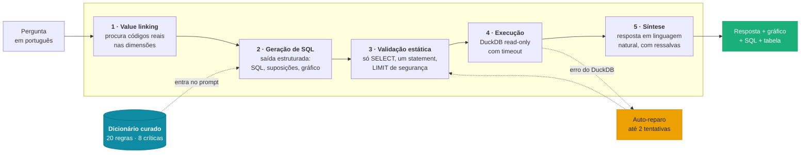

O laço de auto-reparo é **sintático**: dispara quando o SQL levanta exceção.
Para perguntas que exigem mais de uma hipótese analítica existe o
[modo investigação](#modo-investigação).

### As duas decisões que sustentam o resto

**1. O dicionário curado substitui o dump do schema.**

Passar `CREATE TABLE` para o modelo informa que existe uma coluna `SEXO` do tipo
`TINYINT` — e não informa que ela só contém `1` e `3`. O arquivo
[`knowledge/schema.yaml`](knowledge/schema.yaml) descreve o que cada coluna
*significa*, o que está corrompido e o que não se deve fazer. São **20 regras,
8 críticas**, cada uma nascida de uma resposta errada observada.

**2. O modelo declara, o código executa.**

| O modelo produz | O código faz |
|---|---|
| a consulta SQL | valida, injeta `LIMIT`, executa em conexão read-only |
| a *forma* do gráfico e as colunas | monta a série a partir das linhas que o banco devolveu |
| um diagnóstico de 4 perguntas sim/não | deriva se as evidências bastam |

O gráfico nunca contém um número que a consulta não retornou, porque o modelo
não escreve pontos — só declara a forma.

---

## Começar em 5 minutos

### 1. O que você precisa

| | |
|---|---|
| **Python 3.11+** | `python3 --version` |
| **Node 18+** | `node --version` |
| **`sihrd5.duckdb`** | o banco, 15,4 GB — não vai no repositório |
| **Chave da OpenAI** | qualquer conta com crédito |

### 2. Clonar e instalar

```bash
git clone https://github.com/MaiconKevyn/agent-text-to-sql-sus.git
cd agent-text-to-sql-sus

python3 -m venv .venv
.venv/bin/pip install -r requirements.txt

cd frontend && npm install && cd ..
```

### 3. Configurar

Crie um arquivo `.env` **na raiz do projeto**:

```env
# obrigatórios
DATABASE_PATH=duckdb:////caminho/absoluto/para/sihrd5.duckdb?access_mode=read_only
OPENAI_API_KEY=sk-...

# opcionais — estes são os valores padrão
SQL_MODEL=gpt-5-mini
ANSWER_MODEL=gpt-5-mini
QUERY_TIMEOUT_S=120
MAX_REPAIR_ATTEMPTS=2

# opcional — liga a busca web nos temas (fontes oficiais e científicas)
TAVILY_API_KEY=tvly-...
```

> **As quatro barras não são erro de digitação.** `duckdb:////caminho` — o
> esquema pede duas, e o caminho absoluto começa com a sua própria barra. Com
> três, o DuckDB procura um caminho relativo e falha dizendo que o arquivo não
> existe.

> **`access_mode=read_only` é o que garante que nada será escrito.** Sem ele, o
> DuckDB abre para escrita e cria um arquivo `.wal` ao lado do banco.

### 4. Subir os dois processos

A interface e a API são separadas, e **as duas precisam estar de pé**. Abra dois
terminais:

```bash
# terminal 1 — a API (deixe rodando)
.venv/bin/python -m uvicorn src.api:app --port 8000
```

```bash
# terminal 2 — a interface (deixe rodando)
cd frontend && npm run dev
```

Abra **http://localhost:5173**. É esta a primeira tela:

<div align="center">
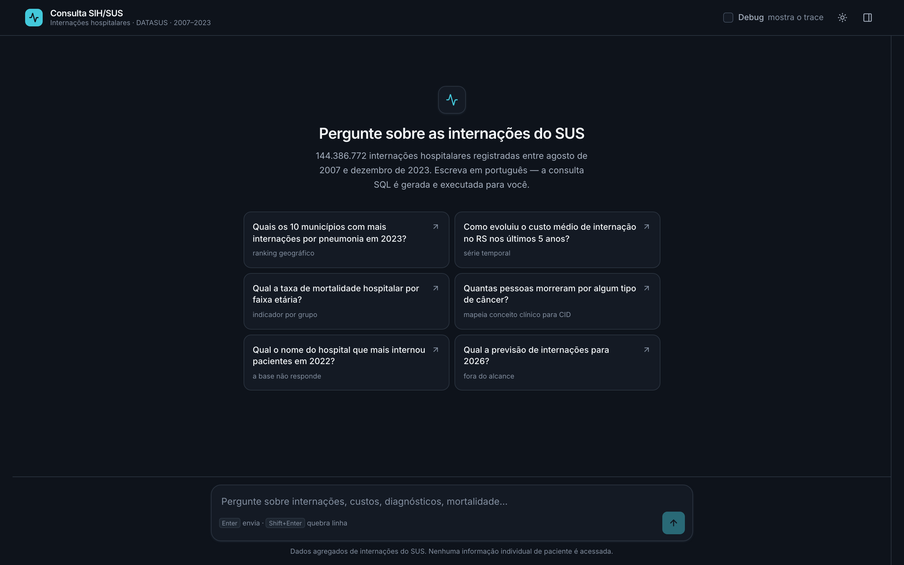
</div>

Para conferir que a API subiu antes de abrir a interface:

```bash
curl http://localhost:8000/api/health
# {"ok":true,"internacoes":144386772,"model":"gpt-5-mini",...}
```

<details>
<summary><b>Não subiu? Os quatro erros mais comuns</b></summary>

| Sintoma | Causa | Conserto |
|---|---|---|
| `/api/health` devolve `"ok": false` com erro de arquivo | caminho do banco errado | confira as **quatro barras** e use caminho absoluto |
| A interface abre mas diz "o backend não respondeu" | a API não está de pé, ou está em outra porta | suba o terminal 1; se mudou a porta, ajuste `VITE_API_URL` |
| `OPENAI_API_KEY não configurada` | o `.env` está na pasta errada | tem de estar na **raiz**, não em `frontend/` |
| A busca web recusa com 503 | falta `TAVILY_API_KEY` | é opcional — sem ela, todo o resto funciona |

</details>

### 5. Sem interface, se preferir

```bash
.venv/bin/python -m src.cli
```

O mesmo agente, no terminal.

---

## As três ferramentas

Elas dividem o mesmo motor de consulta e servem a momentos diferentes. A barra
da esquerda alterna entre as três.

| | Para quê | O que guarda | Quando usar |
|---|---|---|---|
| 💬 **Chat** | uma pergunta, uma resposta | nada — é rascunho | explorar, testar uma hipótese |
| 🔖 **Temas** | acumular evidência sobre um assunto | blocos **congelados**, com SQL e fonte | montar um argumento que precisa ser conferível depois |
| 📊 **Painéis** | acompanhar números que mudam | consultas **vivas**, com filtros | olhar o mesmo recorte de várias formas |

**A diferença entre tema e painel não é de gosto, é de garantia.** O bloco de um
tema fica congelado de propósito: um número citado num relatório precisa
continuar citável daqui a um mês. O widget de um painel precisa do contrário —
recalcular a cada filtro. Se um filtro pudesse mexer num bloco de tema, a
citação apodreceria.

---

## Funcionalidades

### Resposta com gráfico, consulta e dados

O agente decide se um gráfico ajuda e qual forma usar. São sete formas — linha,
barra, barra horizontal, pizza, dispersão, heatmap e empilhada 100% — mais
`nenhum`, escolhido para resultado escalar ou quando as colunas numéricas têm
unidades diferentes.

Os gráficos usam **Apache ECharts** com uma paleta validada nos seis testes do
guia de dataviz, nos temas claro e escuro. Abaixo do texto vêm sempre a consulta
SQL gerada, a tabela paginada com exportação em CSV, e as suposições que o
agente registrou.

### Explorador do banco

<div align="center">

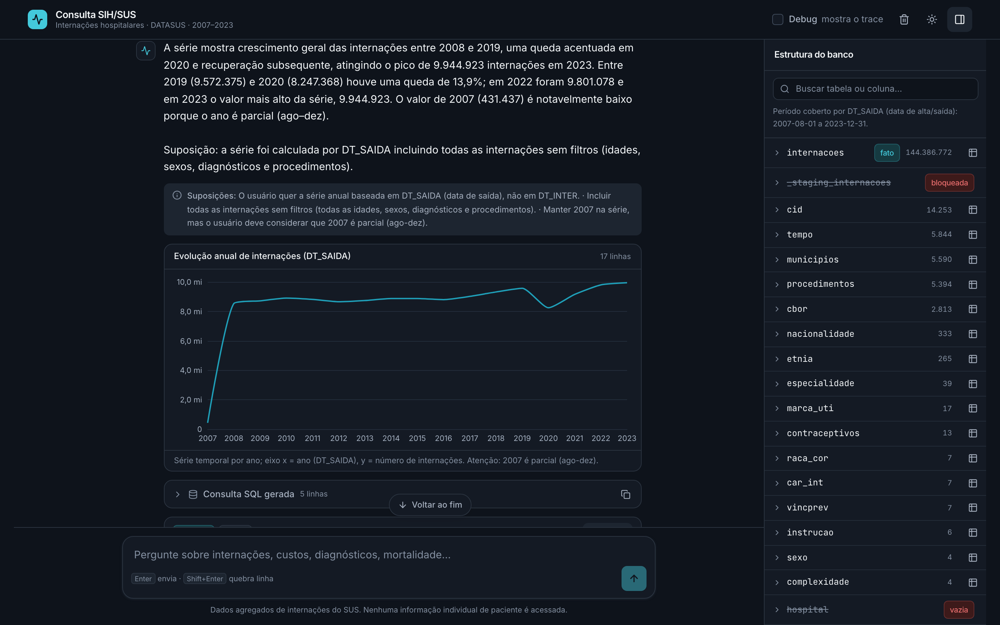

</div>

Tabelas, colunas com descrição e as regras críticas do dicionário. Clicar numa
tabela insere a referência no campo de pergunta.

### Modo investigação

Uma pergunta como *"existe relação entre X e Y?"* não se responde com uma
consulta só. O agente oferece o modo investigação, que roda várias consultas e
devolve um relatório navegável.

<div align="center">

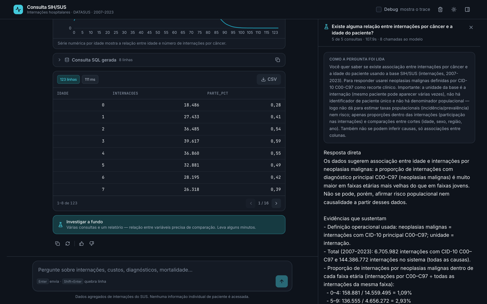

</div>

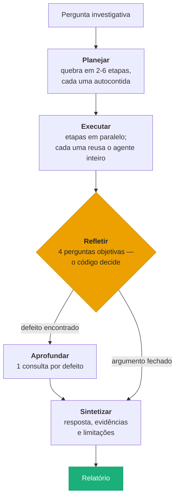

Custo real medido: **~165 s e 8 chamadas ao modelo** por investigação. É um modo
que o usuário escolhe — o chip **oferece**, nunca dispara sozinho.

A reflexão não decide se as evidências bastam: ela responde quatro perguntas
objetivas (*uma etapa falhou? falta denominador? as evidências se contradizem?
alguma pergunta ficou sem resposta?*) e o código deriva a decisão. A versão
anterior deixava o modelo afirmar `suficiente: true` no mesmo retorno em que
descrevia um buraco real — **um schema que permite o modelo se contradizer vai
ser usado para isso.**

### Cada evidência declara o que mediu

<div align="center">

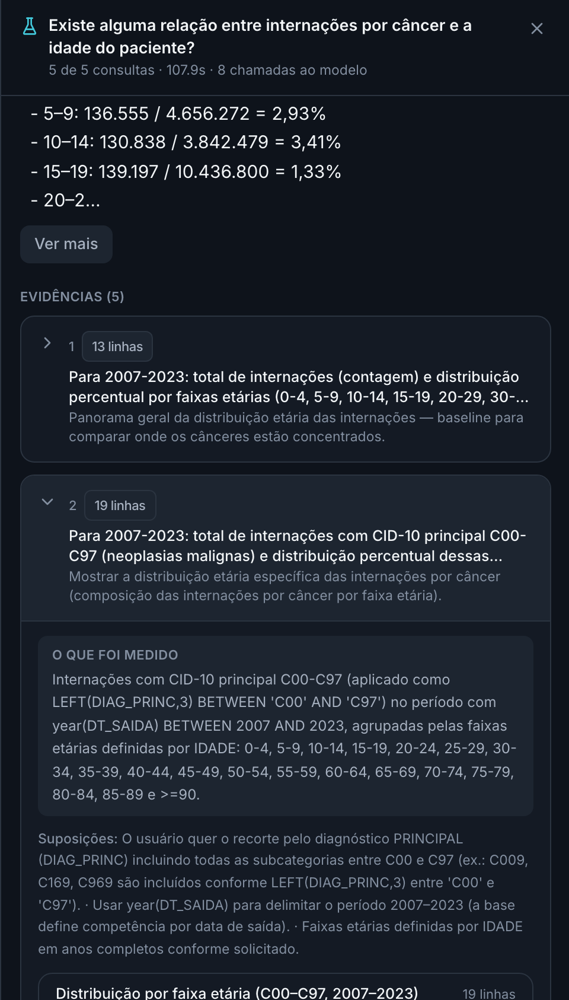

</div>

Todo bloco abre com **"O que foi medido"**: o recorte que a consulta aplicou, em
português, antes de qualquer número.

Isso existe porque uma versão anterior mediu "câncer" como `C00-C97` **mais**
`D00-D48` — que inclui neoplasia benigna e in situ — e rotulou o resultado
apenas como "câncer". O número estava certo e o rótulo errado, o que num painel
é pior: o gráfico circula sem a definição junto.

### Temas: uma investigação que não se perde

<div align="center">
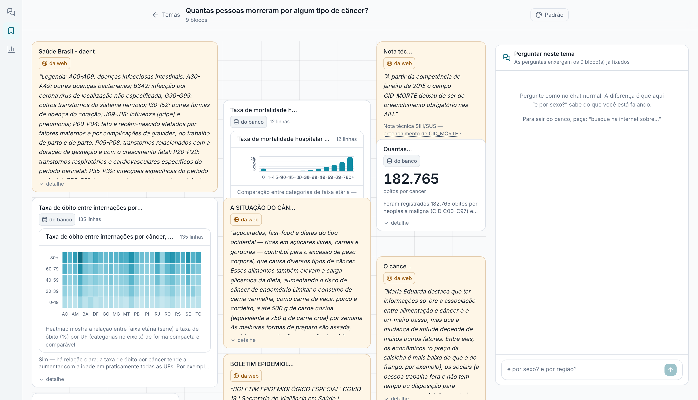
</div>

Um tema é um espaço que acumula evidência sobre um assunto. Qualquer resposta do
chat pode ser **fixada** nele, e cada bloco guarda o resultado inteiro — o SQL, as
linhas, as suposições — para continuar legível daqui a um mês.

**Três coisas que o tema faz e o chat não:**

**1. As perguntas enxergam o que já foi apurado.** Perguntar *"e por sexo?"*
dentro de um tema herda o recorte dos blocos fixados, em vez de contar as 144
milhões de internações.

**2. O tema RESPONDE.** Se a resposta já está num bloco, ele lê o bloco em vez de
reconsultar o banco — e diz de onde tirou:

```
você › quantos óbitos por câncer já apuramos aqui?
       ⌾ respondido com o que já está fixado neste tema
       Foram 182.765 óbitos por neoplasia maligna (CID C00–C97) ¹
       ¹ Quantas pessoas morreram por algum tipo de câncer?
```

Clicar no número da citação rola até o card e o destaca. A regra do produto não
foi afrouxada, foi trocada por uma mais forte: de *"todo número veio da consulta
de agora"* para **"todo número veio de uma evidência identificada"**.

Perguntas *sobre* a investigação — "explique este tema", "o que já sabemos" —
recebem um panorama: do que se trata, o que foi estabelecido separando apuração
de citação, e o que fica em aberto.

**3. Busca em fontes confiáveis, com procedência.** Peça *"busque na internet
sobre X"* e os achados voltam com domínio, trecho literal e link, cada um com um
clique para virar citação no tema. A busca é restrita a domínios oficiais e
científicos (DATASUS, gov.br, IBGE, Fiocruz, SciELO, OMS, PubMed), e **o conteúdo
externo nunca entra no prompt que gera SQL** — uma página é conteúdo de terceiro,
e uma que diga "ignore as instruções anteriores" seria instrução chegando pelo
canal dos dados.

Os blocos se arrastam e se redimensionam livremente. Nada se reorganiza sozinho:
o bloco fica exatamente onde foi solto, e a grade de fundo mostra onde ele cabe.

### Painéis: números que se recalculam

<div align="center">
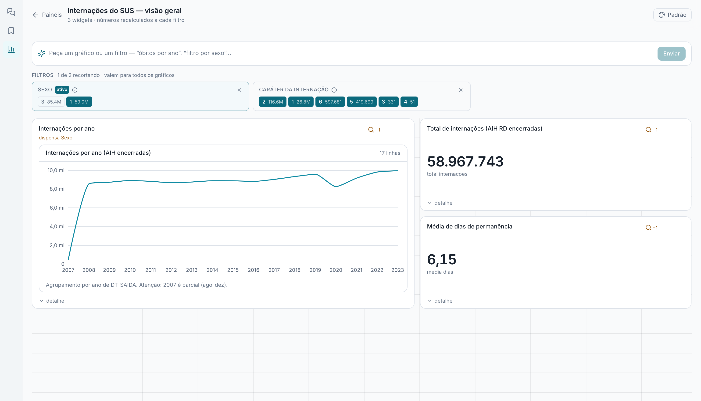
</div>

Um painel é o oposto de um tema: cada widget é uma **consulta viva**, sem
resultado guardado, que roda de novo a cada mudança de filtro.

**A mesma caixa cria gráficos e filtros.** O pedido é classificado antes de agir:

```
"óbitos por ano"                    → widget
"quero ver só mulheres"             → filtro
"um gráfico de internações por sexo"→ widget
"filtro por faixa etária"           → filtro
```

Na dúvida ele escolhe widget — um gráfico a mais se apaga com um clique, um
filtro criado sem querer muda o painel inteiro. Dois botões ao lado forçam a
escolha quando ele erra.

**Os filtros são declarados, não fixos.** Peça *"um filtro por sexo, onde eu
possa escolher um ou os dois"* e o modelo declara a coluna, a forma do controle e
o fragmento SQL; o **código lê o domínio no banco**. Um controle de sexo escrito à
mão diria "Masculino/Feminino"; nesta base os valores são `1` e `3`, com a
contagem de cada um ao lado — e o modelo anota o que significam.

**O filtro alcança o SQL sem regerar nada.** O widget reserva um lugar no `WHERE`
na hora da criação, e o código injeta a conjunção dos filtros ativos. Trocar um
filtro é pura reexecução: determinística, sem modelo no caminho. Regerar o SQL a
cada movimento de slider custaria uma chamada por widget e — pior — não seria
determinístico: o gráfico mudaria por razão que não é o filtro.

### A lupa: qual filtro vale em qual gráfico

<div align="center">
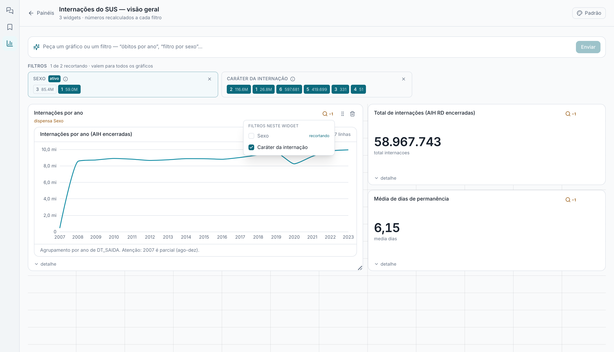
</div>

Por padrão um filtro novo vale para **todos** os gráficos. Mas nem todo recorte
faz sentido em todo lugar: num painel com "óbitos por sexo" ao lado de "total
geral", filtrar o primeiro por sexo o reduz a uma barra.

A lupa de cada widget mostra quais filtros valem ali e permite desligar um. Pela
linguagem também: *"adicione um filtro por caráter da internação, mas aplique só
no gráfico de óbitos"*.

O widget avisa no cabeçalho o que dispensou — e só para filtros que estão de fato
recortando. **Um filtro que silenciosamente vale para metade do painel é pior que
filtro nenhum:** a pessoa move o controle, vê três gráficos mudarem e dois não, e
conclui que os dois não mudaram por causa do dado.

### Aparência: cinco paletas, cromo e gráficos juntos

<div align="center">
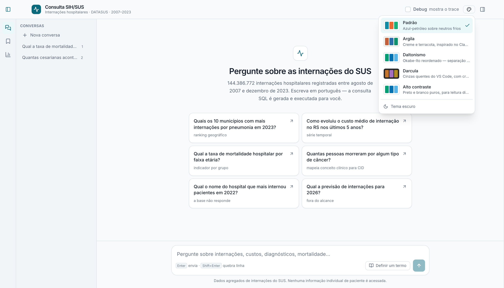
</div>

| Paleta | |
|---|---|
| **Padrão** | azul-petróleo sobre neutros frios |
| **Argila** | creme e terracota, inspirada no Claude |
| **Daltonismo** | Okabe-Ito reordenado |
| **Darcula** | cinzas quentes do VS Code, com croma de dado |
| **Alto contraste** | preto e branco puros |

Cada paleta troca o fundo, as superfícies, o texto, o acento **e as cores das
séries dos gráficos**. Trocar só o cromo seria meia solução — uma paleta para
daltonismo que não alcança o gráfico não serve para nada, porque é no dado que a
cor carrega informação.

As séries não foram escolhidas por gosto: passaram pelo validador de paletas
(banda de luminosidade, piso de croma, separação sob deutan/protan, contraste com
a superfície). Dois achados que valem registro:

- **A ordem importa tanto quanto as cores.** O Okabe-Ito na ordem publicada dá
  ΔE 7,6 no pior par adjacente; reordenado, **18**. Mesmas cinco cores.
- **Cor de editor não é cor de dado.** As cores literais do Darcula *reprovam* —
  são pensadas para texto sobre fundo escuro, têm croma baixo, e `#6A8759` contra
  `#6897BB` dá ΔE 13,8, indistinguível até com visão normal.

Um tema pode ainda ter paleta própria, guardada no servidor: a aparência viaja no
link junto com a investigação.

### Trace de depuração

<div align="center">

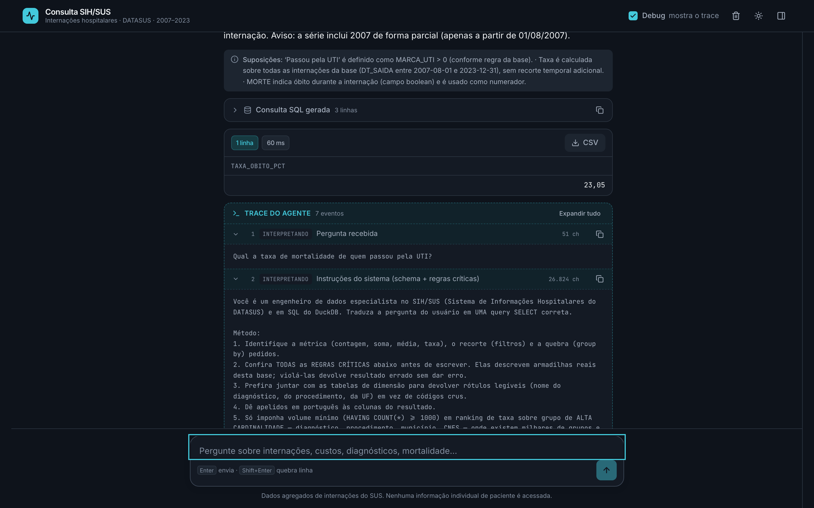

</div>

Com o **Debug** ligado, cada resposta expõe o rastro completo: o prompt do
sistema com o dicionário renderizado (26.824 caracteres), os candidatos que o
value linking encontrou, o plano JSON do modelo, o SQL enviado ao DuckDB e as
tentativas de reparo.

### Perguntas de acompanhamento

A sessão guarda as três últimas rodadas (pergunta + SQL), então o contexto se
mantém:

```
você › Quantas internações de mulheres houve em 2019?     → 5.639.716
você › E em 2020?                                          → 4.832.685
você › Agora quebre por UF.                                → 27 linhas, MG no topo
```

---

## Arquitetura

<div align="center">

<picture>
  <source media="(prefers-color-scheme: dark)" srcset="docs/img/arquitetura-dark.svg">
  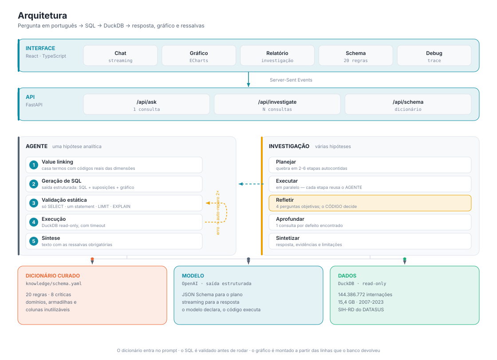
</picture>

</div>

Três camadas, dois modos e três fundações compartilhadas.

**A interface nunca fala com o banco.** Todo o caminho passa pela API, que
transmite por Server-Sent Events — uma pergunta leva ~40 s e uma investigação
passa de dois minutos; sem eventos de progresso a tela ficaria muda.

**Os dois modos compartilham o pipeline.** A fase `Executar` da investigação não
reimplementa nada: ela chama o mesmo `TextToSQLAgent`, então dicionário, value
linking e auto-reparo valem igual nas duas entradas.

**As três fundações servem aos dois.** O dicionário entra no prompt de toda
geração de SQL; o modelo é chamado com saída estruturada em JSON Schema; o
DuckDB é a mesma conexão read-only, aberta uma vez.

### Estrutura de arquivos

```
src/
  agent.py             pipeline; prompts de SQL e de resposta
  llm.py               chamadas à OpenAI, saída estruturada e streaming
  db.py                DuckDB read-only, validação, LIMIT, timeout, parâmetros
  value_linker.py      casa termos da pergunta com valores reais das dimensões
  schema_context.py    renderiza schema.yaml para o prompt
  roteador.py          no chat do tema: banco, web, tema ou os dois
  websearch.py         busca com lista branca de domínios (Tavily)
  storage.py           documentos JSON com escrita atômica
  cli.py               interface de linha de comando
  api.py               FastAPI + Server-Sent Events

  investigation/       o modo de várias consultas
    models.py          Etapa, Achado, Relatorio, Reflexao
    contracts.py       schemas de saída estruturada e prompts
    phases.py          planejar · executar · refletir
    runner.py          orquestra e é o único dono do orçamento

  themes/              TEMAS — evidência congelada, com procedência
    models.py          Tema, Bloco, Definicao; a grade em células
    contexto.py        o que o tema oferece à geração de SQL
    indice.py          catálogo dos blocos (sem dados) e detalhe (com)
    resposta.py        responder A PARTIR dos blocos, citando qual
    store.py           um arquivo JSON por tema

  paineis/             PAINÉIS — consultas vivas, com filtros
    models.py          Painel, Widget; o token {{FILTROS}}
    filtros.py         filtro declarado: fragmento, domínio, seleção
    gerar.py           pergunta → widget com lugar reservado no WHERE
    gerar_filtro.py    pedido → filtro ancorado numa coluna real
    rotear.py          o pedido é um gráfico ou um filtro?
    executar.py        injeta a conjunção e roda; sem modelo no caminho

knowledge/schema.yaml  o dicionário curado — o artefato central

eval/
  ground_truth.yaml    272 casos com SQL gold
  run_eval.py          execution accuracy com tolerância
  testa_graficos.py    escolha da forma do gráfico, ponta a ponta
  testa_reflexao.py    reflexão isolada, com evidências sintéticas

frontend/src/
  components/          chat, resultado, gráfico, schema, relatório, paleta
  theme/               a tela de temas: grade, blocos, chat do tema
  dashboard/           a tela de painéis: filtros, widgets, lupa
  hooks/               useChat, useInvestigation, useTheme, usePaleta
  lib/                 cliente SSE, tipos, paletas, tema dos gráficos
  scripts/             testes sem navegador e captura dos screenshots
```

### Value linking: por que existe, e como quase estragou tudo

Sem value linking o modelo inventa códigos plausíveis: pede-se "pneumonia" e ele
escreve `J18` sem saber se existe. A camada busca os termos da pergunta nas
tabelas de dimensão e injeta os **códigos reais** no prompt.

Com value linking **ingênuo** — `LIKE '%termo%'` — acontece o que aconteceu
aqui: `%dias%` casou com "clamiDIAS" e "meDIAStino", `%base%` com "vasos da
base", o modelo filtrou por esses CIDs e respondeu **18,42 dias** de permanência
média em vez de **5,06**.

A correção foi casar por **limite de palavra** (`\b` do RE2 no DuckDB — não `\y`,
que é do PostgreSQL e não casa nada aqui), somar uma lista de palavras vazias
com vocabulário analítico, e apresentar os candidatos ao modelo como sugestões
descartáveis.

---

## Avaliação

O critério é **execution accuracy**: comparar o texto do SQL não serve, porque
existem muitas consultas corretas para a mesma pergunta. O avaliador roda o SQL
gold e o SQL previsto e compara os **resultados**, com:

- `gold ⊆ pred` — colunas a mais não invalidam, desde que a resposta esteja lá;
- tolerância numérica e comparação na precisão publicada;
- `Decimal.quantize(ROUND_HALF_UP)`, porque o arredondamento bancário do Python
  dá 5,12 onde o DuckDB dá 5,13 — e um valor em 131 derrubava um caso inteiro;
- descarte de linhas "Não informado" dos **dois** lados.

```bash
.venv/bin/python eval/run_eval.py --workers 4
```

| Conjunto ampliado — 272 casos | |
|---|---|
| **Acurácia geral** | **199/272 — 73,2%** |
| SQL executável | 230/237 — 97,0% |
| Recusa correta | 28/35 — 80,0% |

Números de **uma execução completa**, todos apurados do mesmo relatório. Vale
dizer o que isso corrige: a marca anterior de 75,4% somava 179 casos de uma
execução com 26 recuperados ao reavaliar predições antigas depois de consertar o
avaliador e 14 golds. Não era uma medição, era duas.

**Uma rodada isolada não distingue diferenças pequenas.** Reexecutando só os 73
casos que falharam, sem mudar uma linha de código, **11 passaram na segunda
tentativa** — 15% do conjunto de falhas é instável. Na prática: variação de até
uns 4 pontos entre execuções é ruído do modelo, não sinal. Comparações que
dependam de menos que isso precisam de mais de uma rodada.

**A média esconde uma divisão nítida.** Mesmo sistema, mesma execução:

| Origem do caso | Acurácia |
|---|---|
| 57 escritos e conferidos à mão neste projeto | **96,5%** |
| 215 importados de um conjunto externo | **67,0%** |

Trinta pontos não são variação do modelo — são **qualidade de ground truth**. A
maioria das falhas vem de perguntas sub-especificadas, em que mais de uma
resposta é defensável: *"quais capítulos CID têm maior custo?"* não diz quantas
linhas, e o gold trazia um `LIMIT 10` arbitrário.

A lição de engenharia: **um conjunto de avaliação grande e frouxo mede menos que
um pequeno e preciso.** Nas categorias em que a pergunta é inequívoca o
desempenho se mantém alto — `armadilha` 10/10, `dado_corrompido` 3/3,
`agregacao_simples` 22/23, `filtro` 86%.

O ponto fraco é nítido e não é ambiguidade de enunciado: **`agregacao_complexa`,
17/44 — 38,6%**, a pior categoria e a terceira maior. São as perguntas com
janela, percentil, média móvel ou comparação entre dois recortes na mesma
consulta. É aí que vale trabalhar.

### Outros testes

```bash
# agente
.venv/bin/python eval/testa_graficos.py      # 7/7 — forma do gráfico, ponta a ponta
.venv/bin/python eval/testa_reflexao.py      # 3/3 — reflexão, sem tocar o banco

# interface — rodam em segundos, sem navegador e sem banco
node --experimental-strip-types frontend/scripts/testa_grade.mjs
node --experimental-strip-types frontend/scripts/testa_paletas.mjs
```

`testa_grade.mjs` cobre a geometria do painel: 800 arranjos aleatórios provando
que **nenhum vizinho se move** e que o alvo vai exatamente para onde foi pedido.
`testa_paletas.mjs` mede o contraste de texto das nove combinações paleta×modo —
ele foi quem descobriu que o tema **padrão** já reprovava, com `--ink-subtle` a
3,9:1 onde o comentário no CSS prometia 4,7:1.

---

## Segurança

- Conexão DuckDB em **read-only**; nenhuma escrita é possível.
- Validação estática antes de executar: só `SELECT`/`WITH`, um único statement,
  tabelas de staging bloqueadas.
- `EXPLAIN` como ensaio, para pegar erro de sintaxe ou coluna inexistente sem
  varrer 144 milhões de linhas.
- `LIMIT` injetado quando ausente; timeout que interrompe o cursor.
- A interface trabalha **só com agregados** — nenhuma informação individual de
  paciente é exibida.
- **Valor de filtro vai vinculado, nunca concatenado.** O painel usa parâmetros
  do DuckDB, então um valor vindo da tela não pode virar sintaxe. Conferido com
  `B342' OR '1'='1` e `x'; DROP TABLE internacoes; --` — os dois viraram texto e
  devolveram zero, com a tabela intacta.
- **Conteúdo da web nunca alcança a geração de SQL.** Ele chega ao redator da
  resposta cercado e rotulado como conteúdo de terceiro, com instrução de ignorar
  comandos que apareçam dentro. A lista branca de domínios reduz a superfície; a
  barreira a fecha.

---

## Limitações conhecidas

**Da base**, e nenhuma engenharia resolve:

- A unidade é a **internação**, não a pessoa. Reinternações contam várias vezes,
  e não existe identificador de paciente.
- **Não há denominador populacional.** Nada de incidência, prevalência ou risco
  por 100 mil habitantes — só participação nas internações.
- Não há como estabelecer **causa**, apenas associação entre colunas.
- SP e TO estão gravemente sub-representados por falha de extração.
- `CID_MORTE` e `DIAG_SECUN` deixam de ser preenchidas a partir de 2015.

**Do sistema**, e são trabalho pendente:

- A reflexão da investigação está provada em teste isolado (3/3 com evidências
  sintéticas), mas **ainda não disparou numa investigação real**: nos casos
  testados o plano inicial já vinha completo.
- `agregacao_complexa` fica em 38,6%. Não é ruído nem ambiguidade de enunciado —
  é limite real do sistema em consultas com janela, percentil e média móvel.
- A acurácia é de **uma** execução, e o modelo varia: 15% das falhas passam numa
  segunda tentativa. O número tem uma margem de uns 4 pontos.
- O painel **reexecuta todos os widgets** a cada mudança de filtro. O endpoint já
  aceita `?only=` para limitar aos visíveis, e a tela ainda não usa: com poucos
  widgets não incomoda, com vinte vai.
- Não há **formulário** para montar um widget escolhendo coluna, agregação e tipo
  de gráfico à mão. O caminho é a linguagem natural mais o ajuste por arrasto.
- A grade é sempre de 12 colunas, sem quebra para tela estreita. Em desktop está
  certo; num celular fica apertado.

---

## Documentos

| | |
|---|---|
| [`docs/PROFILING.md`](docs/PROFILING.md) | o levantamento do banco que originou o dicionário |
| [`knowledge/schema.yaml`](knowledge/schema.yaml) | as 20 regras, cada uma com a evidência que a motivou |
| [`eval/ground_truth.yaml`](eval/ground_truth.yaml) | os 272 casos com SQL gold |
| [`docs/gera_arquitetura.py`](docs/gera_arquitetura.py) | gera o diagrama acima, nas versões clara e escura |
| [`src/paineis/filtros.py`](src/paineis/filtros.py) | por que um filtro inativo não entra na consulta |
| [`src/themes/resposta.py`](src/themes/resposta.py) | as três guardas de responder a partir de um bloco |

---

<div align="center">
<sub>

Os screenshots deste README são capturados contra a aplicação real por
[`screenshots.mjs`](frontend/scripts/screenshots.mjs) e
[`screenshots-painel.mjs`](frontend/scripts/screenshots-painel.mjs) — os scripts
sobem um Chromium, digitam as perguntas na interface e esperam o agente
responder. Nada é montado para a foto: os números nas imagens vieram do DuckDB.

</sub>
</div>
