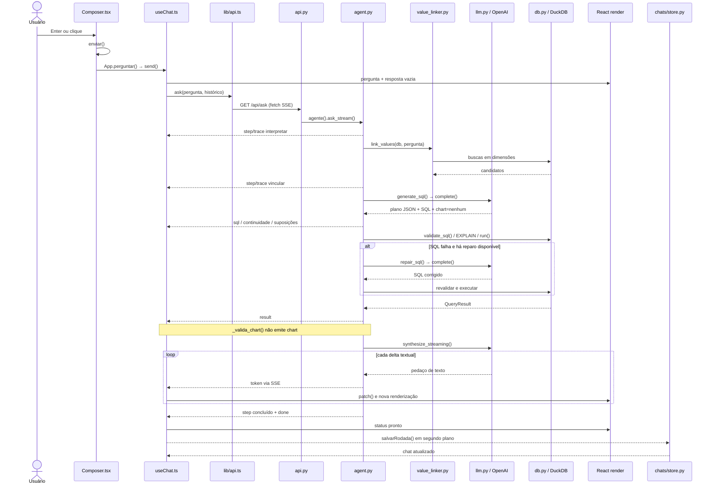

# Fluxo completo do chat sem geração de gráfico

## Objetivo e escopo

Este documento descreve, no nível de arquivos, funções, chamadas, objetos e eventos,
o caminho executado desde o instante em que uma pessoa envia uma pergunta no chat web
até o instante em que a resposta textual fica pronta na interface e a rodada é salva.

O escopo é deliberadamente restrito a:

- interface React do chat normal;
- endpoint `GET /api/ask`;
- pipeline text-to-SQL;
- busca de códigos reais nas dimensões;
- geração, validação, reparo e execução do SQL;
- síntese textual em streaming;
- exibição do texto, SQL e tabela;
- histórico de até três rodadas;
- persistência local da conversa.

Ficam fora do escopo:

- temas;
- painéis;
- modo investigação;
- busca web;
- explorador de schema como interação independente;
- resolução manual de conceitos;
- construção e renderização de gráficos.

### Precisão importante sobre “sem gráfico”

O contrato atual da geração de SQL **sempre exige** o campo `chart`, mesmo quando o
chat não deve mostrar gráfico. Portanto, o cenário descrito aqui pressupõe que o modelo
retorna algo equivalente a:

```json
{
  "chart": {
    "kind": "nenhum",
    "x": "",
    "y": "",
    "series": "",
    "title": "",
    "reason": "A resposta textual e a tabela são suficientes."
  }
}
```

Depois da execução do SQL, `TextToSQLAgent.ask_stream()` ainda chama
`_valida_chart()`. Como `kind` é `nenhum`, a função devolve `spec=None`; nenhum evento
`chart` é enviado e `ResultChart` não é montado no frontend. Este documento registra
esse ponto apenas para manter o fluxo fiel ao código, mas não acompanha a geração visual.

---

## 1. Resumo executivo do caminho

```text
Composer.enviar()
  → App.perguntar()
  → useChat.send()
  → novaRespostaVazia()
  → useChat.consumir()
  → frontend/lib/api.ask()
  → frontend/lib/api.fluxo()
  → fetch GET /api/ask
  → src/api.ask()
  → src/api.fluxo() [função interna]
  → src/api.agente()
  → TextToSQLAgent.ask_stream()
      → link_values()
      → TextToSQLAgent.generate_sql()
          → TextToSQLAgent._render_history()
          → llm.complete()
              → llm.client()
              → OpenAI chat.completions.create()
      → _clean_sql()
      → _continuidade() [somente quando há histórico]
      → TextToSQLAgent._execute_with_repair()
          → validate_sql()
          → Database.explain()
              → validate_sql()
              → DuckDB EXPLAIN
          → Database.run()
              → validate_sql()
              → enforce_limit()
              → DuckDB execute/fetchall
          → TextToSQLAgent.repair_sql() [somente se houver erro]
              → llm.complete()
      → linhas_json()
      → _valida_chart() → nenhum gráfico
      → TextToSQLAgent.synthesize_streaming()
          → TextToSQLAgent._payload_resposta()
              → _format_rows()
          → llm.complete_streaming()
              → OpenAI chat.completions.create(stream=True)
  → src/api.sse() para cada evento
  → frontend/lib/api.fluxo() decodifica cada bloco SSE
  → useChat.consumir() reduz cada StreamEvent no estado React
  → useChat.patch()
  → MessageList()
  → AgentMessageBubble()
      → ThinkingSteps()
      → StreamedText()
      → SqlBlock()
      → ResultTable()
  → evento done marca a mensagem como pronta
  → useChat.salvarRodada()
      → createChat() [somente na primeira rodada]
      → appendTurn()
      → src/api.criar_chat() / src/api.acrescentar_rodada()
      → Conversas.criar() / Conversas.acrescentar()
      → Documentos.salvar()
      → data/chats/chat_<id>.json
```

O usuário não espera a persistência terminar para considerar a resposta pronta. O
evento `done` finaliza a mensagem na tela; a gravação da rodada é disparada depois, sem
`await`, no bloco `finally` de `consumir()`.

---

## 2. Arquivos e responsabilidades

| Camada | Arquivo | Funções/classes centrais | Responsabilidade no fluxo |
|---|---|---|---|
| Inicialização web | `frontend/src/main.tsx` | `createRoot(...).render()` | Escolhe a tela normal e monta `App` quando não há parâmetros de lab, painel ou tema. |
| Composição da tela | `frontend/src/App.tsx` | `App`, `perguntar` | Conecta `Composer`, `MessageList` e o hook `useChat`. |
| Entrada do usuário | `frontend/src/components/chat/Composer.tsx` | `Composer`, `enviar` | Mantém o texto controlado, trata Enter/clique, bloqueia envio vazio ou concorrente. |
| Estado do chat | `frontend/src/hooks/useChat.ts` | `useChat`, `send`, `consumir`, `patch`, `salvarRodada` | Cria mensagens, consome SSE, reduz eventos, mantém histórico, lida com falhas e salva a rodada. |
| Cliente HTTP/SSE | `frontend/src/lib/api.ts` | `ask`, `fluxo`, `json`, `createChat`, `appendTurn` | Constrói a URL, abre `fetch`, decodifica SSE e chama rotas de persistência. |
| Contrato frontend | `frontend/src/lib/types.ts` | `StreamEvent`, `AgentMessage`, `QueryResult`, `Turn`, `ChatTurn` | Define as formas aceitas pelo estado React e pelo stream. |
| Lista de mensagens | `frontend/src/components/chat/MessageList.tsx` | `MessageList` | Decide qual componente renderiza cada mensagem e mantém a região `aria-live`. |
| Resposta do agente | `frontend/src/components/chat/AgentMessage.tsx` | `AgentMessageBubble` | Exibe progresso, falhas, texto, suposições, SQL e tabela. |
| Progresso | `frontend/src/components/chat/ThinkingSteps.tsx` | `ThinkingSteps`, `Marcador` | Traduz eventos `step` em estados visuais. |
| Texto em streaming | `frontend/src/components/chat/StreamedText.tsx` | `StreamedText` | Exibe texto parcial com cursor e aplica “ver mais” após o término. |
| SQL exibido | `frontend/src/components/result/SqlBlock.tsx` | `SqlBlock` | Mostra o SQL em acordeão, inicialmente fechado. |
| Tabela exibida | `frontend/src/components/result/ResultTable.tsx` | `ResultTable`, `alternarOrdem` | Exibe até as linhas recebidas pelo frontend, com paginação, ordenação e CSV. |
| Auto-scroll | `frontend/src/hooks/useAutoScroll.ts` | `useAutoScroll`, `scrollToBottom` | Mantém a conversa no final enquanto novos tokens chegam, salvo se o usuário subir. |
| Configuração | `src/config.py` | `Settings`, `settings` | Carrega `.env`, modelos, limites, timeout, caminhos e número de reparos. |
| API HTTP | `src/api.py` | `ask`, `sse`, `agente`, `erro_com_cors` | Valida query params, cria o `StreamingResponse`, serializa eventos e gerencia o agente singleton. |
| Orquestração | `src/agent.py` | `TextToSQLAgent`, `ask_stream`, `generate_sql`, `_execute_with_repair`, `synthesize_streaming` | Coordena todas as fases da pergunta. |
| Contexto curado | `src/schema_context.py` | `load_schema`, `_render_table`, `build_schema_prompt`, `capability_notes` | Converte `knowledge/schema.yaml` em instruções para o modelo SQL. |
| Ligação de valores | `src/value_linker.py` | `link_values`, `_terms`, `_explicit_cids`, `_word_prefix_match`, `strip_accents` | Procura códigos reais de CID, procedimento e município antes da geração do SQL. |
| Provedor de LLM | `src/llm.py` | `client`, `complete`, `complete_streaming`, `_repara_escapes` | Encapsula o SDK OpenAI e os dois modos de chamada usados pelo chat. |
| Banco e segurança | `src/db.py` | `Database`, `validate_sql`, `enforce_limit`, `Database.explain`, `Database.run`, `linhas_json` | Abre DuckDB read-only, valida SQL, impõe limites, interrompe por timeout e normaliza valores para JSON. |
| Modelo de conversa | `src/chats/models.py` | `Rodada`, `Chat`, `_agora` | Define o JSON salvo, o título e timestamps da conversa. |
| Repositório de chats | `src/chats/store.py` | `Conversas` | Cria, lê, lista e acrescenta rodadas a conversas. |
| Persistência genérica | `src/storage.py` | `Documentos` | Valida IDs, faz leitura JSON, aplica lock e escrita atômica com `os.replace`. |
| Conhecimento | `knowledge/schema.yaml` | dados declarativos | Contém tabelas, colunas, domínios, junções, regras críticas e exemplos resolvidos. |

---

## 3. Estado preparado antes da pergunta

### 3.1 Frontend

`frontend/src/main.tsx` monta `App` quando a URL não seleciona laboratório, painel ou
tema. Dentro de `App()`:

1. `useChat()` cria o estado local do chat.
2. `messages` começa como `[]`.
3. `busy` começa como `false`.
4. `abort` guarda futuramente o `AbortController` da requisição ativa.
5. `historico.current` começa como `[]`.
6. `chatId.current` começa como `null`.
7. `App` passa `perguntar` para `Composer.onSend` e para sugestões da tela vazia.
8. `App` passa `messages` para `MessageList`.

O histórico usado pelo modelo não é todo o estado visual do chat. Ele guarda somente:

```ts
type Turn = {
  question: string;
  sql: string | null;
}
```

Logo, respostas textuais antigas, tabelas antigas, suposições antigas e traces antigos
não são reenviados ao modelo SQL. Para continuidade, o backend recebe no máximo as três
últimas combinações de pergunta e SQL.

### 3.2 Backend

Ao importar `src/config.py`, `load_dotenv(ROOT / ".env")` carrega a configuração. A
instância imutável `settings = Settings()` captura:

- `DATABASE_PATH`;
- `OPENAI_API_KEY`;
- `SQL_MODEL`;
- `ANSWER_MODEL`;
- `MAX_ROWS_TO_LLM`, padrão 50;
- `DEFAULT_LIMIT`, padrão 100;
- `QUERY_TIMEOUT_S`, padrão 120;
- `MAX_REPAIR_ATTEMPTS`, padrão 2;
- `CHATS_DIR`, padrão `data/chats`.

O banco e o agente **não** são abertos na importação. `src/api.py` mantém `_db=None` e
`_agent=None`. A criação é lazy em `agente()`, na primeira pergunta que efetivamente
começa a iterar o stream.

---

## 4. Fluxo cronológico detalhado

## 4.1 O usuário envia o texto

**Arquivo:** `frontend/src/components/chat/Composer.tsx`  
**Função principal:** `enviar()`

Há dois gatilhos equivalentes:

1. `textarea.onKeyDown` detecta `Enter` sem `Shift`, chama `preventDefault()` e então
   `enviar()`;
2. o botão “Enviar pergunta” chama `enviar()` em `onClick`.

`enviar()` executa:

```ts
const t = valor.trim();
if (!t || busy) return;
onSend(t);
setValor("");
```

Consequências:

- espaços externos são removidos;
- texto vazio não sai do navegador;
- uma nova pergunta é recusada enquanto `busy` está verdadeiro;
- `onSend` é `App.perguntar`;
- depois do encaminhamento, o campo é limpo.

Uma pergunta escolhida na tela inicial não passa por `Composer.enviar()`. Ela entra em
`MessageList.onPick`, que também aponta para `App.perguntar`; a partir daí o caminho é o
mesmo.

## 4.2 `App.perguntar()` entrega a pergunta ao hook

**Arquivo:** `frontend/src/App.tsx`  
**Função:** callback `perguntar`

```ts
const perguntar = useCallback((q: string) => {
  send(q);
  if (isMobile) setSchemaOpen(false);
}, [send, isMobile]);
```

No desktop, ele apenas chama `send`. No mobile, também fecha o explorador de schema para
liberar a área da conversa.

## 4.3 `useChat.send()` cria as duas mensagens imediatamente

**Arquivo:** `frontend/src/hooks/useChat.ts`  
**Funções:** `send()`, `novaRespostaVazia()`, `passosIniciais()`, `uid()`

`send()` repete a normalização e a guarda de concorrência:

1. executa `texto.trim()`;
2. retorna se a pergunta ficar vazia ou se `busy` já for verdadeiro;
3. chama `novaRespostaVazia(pergunta)`;
4. acrescenta ao estado uma `UserMessage` e uma `AgentMessage` vazia;
5. dispara `void consumir(pergunta, resposta.id)` sem bloquear o event loop.

`novaRespostaVazia()` cria:

```ts
{
  id: uid(),
  role: "agent",
  text: "",
  status: "pensando",
  steps: [
    interpretar,
    vincular,
    gerar-sql,
    executar,
    resumir
  ],
  trace: [],
  at: Date.now(),
  sourceQuestion: pergunta
}
```

`passosIniciais()` usa `STEP_LABELS` de `frontend/src/lib/types.ts` para associar os
identificadores às frases exibidas. `uid()` em `frontend/src/lib/utils.ts` produz IDs
locais curtos com `Math.random().toString(36).slice(2, 10)`.

Neste ponto, antes de qualquer chamada HTTP terminar, o usuário já vê:

- a própria pergunta;
- a bolha vazia do agente;
- as cinco etapas pendentes.

## 4.4 `useChat.consumir()` prepara a requisição e a rodada acumuladora

**Arquivo:** `frontend/src/hooks/useChat.ts`  
**Função:** callback assíncrono `consumir(pergunta, respostaId)`

`consumir()`:

1. cria `const ctrl = new AbortController()`;
2. guarda esse controlador em `abort.current`;
3. chama `setBusy(true)`;
4. cria `rodada = { question: pergunta }` fora do estado React;
5. chama o async generator `ask(pergunta, { signal, history })`;
6. usa `for await` para receber eventos um a um.

O objeto `rodada` é intencionalmente separado de `messages`. Ele acumula o que será salvo
em disco sem executar efeitos colaterais dentro de um atualizador React.

O histórico enviado é `historico.current`, com no máximo três turnos. Na primeira
pergunta, ele é vazio.

## 4.5 `frontend/lib/api.ask()` constrói a URL

**Arquivo:** `frontend/src/lib/api.ts`  
**Função:** async generator `ask(question, options)`

`ask()`:

1. cria `new URL("/api/ask", BASE)`;
2. define `q` com `url.searchParams.set("q", question)`;
3. se houver histórico, serializa somente `{question, sql}` em JSON e define o parâmetro
   `history`;
4. delega a leitura para `yield* fluxo<StreamEvent>(url, signal)`.

`BASE` vem de `VITE_API_URL`; sem configuração, é `http://localhost:8000`.

Exemplo conceitual de requisição:

```http
GET /api/ask?q=Quantas%20internacoes...&history=[{"question":"...","sql":"SELECT ..."}]
Accept: text/event-stream
```

Como a pergunta e o histórico viajam na query string, eles podem aparecer no histórico
de rede do navegador e em logs de proxy/servidor. O corpo HTTP não é usado nesta rota.

## 4.6 `frontend/lib/api.fluxo()` abre e decodifica o SSE

**Arquivo:** `frontend/src/lib/api.ts`  
**Função:** async generator genérico `fluxo<T>(url, signal)`

O cliente usa `fetch`, e não `EventSource`, porque precisa de `AbortSignal` e não quer a
reconexão automática do `EventSource`.

Passos:

1. chama `fetch(url, { signal, headers: { Accept: "text/event-stream" } })`;
2. se a conexão falhar, cria `BackendOffline`, salvo se o abort foi intencional;
3. rejeita resposta sem `ok` ou sem `body`;
4. passa o corpo por `TextDecoderStream`;
5. obtém um `ReadableStreamDefaultReader`;
6. acumula texto em `buffer`;
7. separa eventos pelo delimitador SSE `\n\n`;
8. conserva somente linhas iniciadas por `data:`;
9. concatena o payload dessas linhas;
10. executa `JSON.parse(payload)`;
11. faz `yield` do objeto tipado como `StreamEvent`;
12. no `finally`, chama `leitor.cancel()`.

Um bloco SSE com JSON inválido é ignorado silenciosamente. Não há retransmissão.

## 4.7 FastAPI valida parâmetros e cria o stream

**Arquivo:** `src/api.py`  
**Função de rota:** `ask(q, history)`  
**Funções auxiliares:** função interna `fluxo()`, `sse()`, `agente()`

FastAPI valida automaticamente:

- `q` obrigatório;
- mínimo de 2 caracteres;
- máximo de 2.000 caracteres;
- `history` opcional.

Se `history` existir, a rota:

1. executa `json.loads(history)`;
2. descarta entradas sem `question`;
3. converte cada entrada em `Turn(question=..., sql=...)`;
4. se qualquer erro ocorrer, usa `turnos=[]` em vez de falhar a pergunta.

A função interna `fluxo()` itera:

```python
for evento in agente().ask_stream(q, turnos):
    yield sse(evento)
```

`sse(evento)` executa `json.dumps(..., ensure_ascii=False)` e envolve o JSON assim:

```text
data: {json}\n\n
```

O `StreamingResponse` é devolvido com:

- `media_type="text/event-stream"`;
- `Cache-Control: no-cache, no-transform`;
- `Connection: keep-alive`;
- `X-Accel-Buffering: no`.

Esses cabeçalhos evitam cache, transformação e buffering por proxy, preservando a chegada
incremental dos eventos.

Se uma exceção escapar de `ask_stream`, a função interna emite:

1. `failure` com `kind="rede"`;
2. `done`.

O middleware `erro_com_cors()` cobre erros que aconteçam fora ou antes da iteração do
stream e devolve JSON 500 com os cabeçalhos CORS.

## 4.8 `agente()` inicializa o backend na primeira pergunta

**Arquivo:** `src/api.py`  
**Função:** `agente()`

Na primeira chamada do processo:

1. cria `Database()`;
2. cria `TextToSQLAgent(db=_db)`;
3. guarda ambos em variáveis globais;
4. reutiliza as mesmas instâncias nas perguntas seguintes.

### `Database.__init__()`

**Arquivo:** `src/db.py`

1. `_parse_database_path()` converte a URL `duckdb:///...` em caminho local;
2. `duckdb.connect(path, read_only=True)` abre o arquivo sem permissão de escrita;
3. executa `PRAGMA threads=8`;
4. cria um `threading.Lock` compartilhado por todas as operações da conexão.

### `TextToSQLAgent.__init__()`

**Arquivo:** `src/agent.py`

1. guarda a instância de `Database`;
2. chama `build_schema_prompt()`;
3. chama `capability_notes()`;
4. interpola ambos em `SQL_SYSTEM_PROMPT`;
5. guarda o prompt final em `self._system`;
6. inicia `self._trace_seq = 0`.

`build_schema_prompt()` e `capability_notes()` usam `lru_cache(maxsize=1)`. O arquivo
`knowledge/schema.yaml` é lido uma vez por processo por `load_schema()`. O contexto
montado inclui:

- engine e notas de dialeto;
- granularidade e período;
- tabelas, colunas, tipos, descrições e domínios;
- tabelas proibidas;
- junções canônicas;
- regras críticas;
- exemplos resolvidos;
- capacidades ausentes.

Consequência operacional: a primeira pergunta pode esperar a abertura do DuckDB e a
montagem do contexto antes do primeiro evento `step`. As perguntas seguintes reutilizam
essas estruturas.

## 4.9 `TextToSQLAgent.ask_stream()` inicia a fase “interpretar”

**Arquivo:** `src/agent.py`  
**Método:** `TextToSQLAgent.ask_stream(question, history, contexto_tema="")`

Este é o orquestrador realmente usado pelo chat HTTP. Ele define duas funções locais:

- `passo(id_, estado, **extra)`: cria eventos `step`;
- `rastro(etapa, titulo, corpo, fmt, **extra)`: cria eventos `trace` e incrementa
  `self._trace_seq`.

A fase “interpretar” não chama um modelo. Ela relata o que já existe:

1. `step interpretar ativo`;
2. trace com a pergunta recebida;
3. trace com `self._system`, o prompt completo de schema e regras;
4. `step interpretar concluido` com duração e tamanho do contexto.

No chat normal, `contexto_tema` é string vazia; portanto, o trace específico de tema não
é produzido.

## 4.10 Value linking: termos da pergunta viram candidatos reais

**Arquivo:** `src/value_linker.py`  
**Entrada:** `link_values(self.db, question)`

`ask_stream()` marca `vincular` como ativo e chama `link_values()`. Toda a etapa é
auxiliar: exceções são capturadas e não interrompem o pipeline principal.

### 4.10.1 CIDs explícitos

`_explicit_cids(question)` usa regex para capturar códigos como `J18` ou `J18.9` e os
normaliza para a grafia sem ponto usada no banco.

Se houver códigos:

1. monta uma lista alfanumérica protegida contra aspas;
2. chama `Database.run()` sobre a tabela `cid`;
3. pede código, descrição e nível;
4. usa `LIMIT 20` explícito;
5. inclui os resultados no bloco de dicas.

### 4.10.2 Termos livres

`_terms(question)`:

1. extrai palavras com regex;
2. converte para minúsculas;
3. chama `strip_accents()`;
4. remove stopwords gramaticais, métricas, nomes genéricos da base e verbos de comando;
5. descarta termos curtos;
6. aplica um radical simples para plural/flexão;
7. remove duplicatas preservando a ordem.

`link_values()` usa no máximo os seis primeiros termos. Para cada conjunto, gera buscas
com `_word_prefix_match()`, que exige fronteira de palavra e prefixo, evitando casamento
acidental por substring.

São consultadas sequencialmente:

- `cid`, coluna `DESCRICAO`, apenas nível `CAT`;
- `procedimentos`, coluna `NOME_PROC`;
- `municipios`, coluna `NO_MUNICIPIO`.

Cada fonte limita o resultado a oito candidatos por padrão. Se uma busca falha, apenas
aquela fonte é ignorada.

### 4.10.3 Saída do value linking

Se houver correspondências, `link_values()` devolve texto de candidatos e avisa ao
modelo que são sugestões descartáveis, não instruções obrigatórias.

Se não houver correspondência, devolve `""`.

`ask_stream()` chama `_termos_da_pergunta()` novamente apenas para produzir o detalhe do
evento visual. Em seguida:

- com dicas: emite trace e `step vincular concluido`;
- sem dicas: emite trace explicativo e `step vincular pulado`.

As consultas de value linking usam a mesma conexão DuckDB, o mesmo lock e a mesma camada
de validação das consultas finais.

## 4.11 Geração estruturada do SQL

**Arquivo:** `src/agent.py`  
**Método:** `TextToSQLAgent.generate_sql()`

`ask_stream()` marca `gerar-sql` como ativo e chama:

```python
plan = self.generate_sql(question, hints, history, contexto_tema)
```

No chat normal, `contexto_tema` permanece vazio.

### 4.11.1 Construção da mensagem de usuário

`generate_sql()` começa com:

```text
Pergunta: <texto do usuário>
```

Se `hints` não estiver vazio, anexa o bloco do value linking.

### 4.11.2 Histórico de continuidade

`_render_history(history)`:

1. retorna `""` se não houver turnos;
2. ignora turnos sem SQL;
3. para cada turno restante, inclui pergunta anterior e SQL usado;
4. usa no máximo `HISTORY_TURNS=3`;
5. instrui o modelo a decidir continuidade pelo assunto;
6. instrui a manter filtros anteriores em caso de dúvida;
7. exige declarar filtros herdados e descartados.

O histórico não contém a resposta textual anterior nem o resultado anterior.

### 4.11.3 Escolha do schema de saída

- sem histórico SQL válido: usa `SQL_SCHEMA`;
- com histórico SQL válido: usa `SQL_SCHEMA_COM_HISTORICO`.

Ambos são JSON Schemas estritos, sem propriedades adicionais. O segundo acrescenta
`continuidade` com:

- `tipo`: `acompanhamento` ou `nova`;
- `herdado`: filtros mantidos;
- `descartado`: filtros abandonados e motivo.

Mesmo no escopo sem gráfico, o schema base exige `chart`; o modelo deve escolher
`kind="nenhum"` para não abrir a ramificação visual.

### 4.11.4 Chamada ao provedor

`generate_sql()` chama `src/llm.py::complete()` com:

- `model=settings.sql_model`;
- `system=self._system`;
- uma mensagem de usuário com pergunta, hints e histórico;
- `schema=SQL_SCHEMA` ou `SQL_SCHEMA_COM_HISTORICO`;
- `schema_name="geracao_sql"`;
- `reasoning_effort="medium"`.

`complete()`:

1. monta `messages=[system, user]`;
2. configura `response_format.type="json_schema"`;
3. ativa `strict=True`;
4. só envia `reasoning_effort` para famílias compatíveis;
5. chama `client().chat.completions.create(...)`;
6. lê `resp.choices[0].message.content`;
7. passa o texto por `_repara_escapes()`;
8. executa `json.loads()`;
9. devolve um `dict`.

`client()` cria uma instância singleton de `OpenAI` no primeiro uso, exige
`OPENAI_API_KEY`, usa timeout de 210 segundos e `max_retries=1`.

Esta etapa não é transmitida token a token. O frontend apenas vê `gerar-sql` ativo até o
JSON completo estar disponível.

### 4.11.5 Plano devolvido

O plano contém, no mínimo:

```python
{
    "answerable": bool,
    "reasoning": str,
    "sql": str,
    "assumptions": list[str],
    "refusal": str,
    "chart": dict
}
```

Com histórico, inclui também `continuidade`.

`ask_stream()` registra o plano completo em um evento `trace` de formato JSON.

Se a chamada ao modelo falhar ou o JSON não puder ser lido, `ask_stream()`:

1. marca `gerar-sql` como `falhou`;
2. emite `failure` com `kind="rede"`;
3. encerra o generator sem `done`.

## 4.12 Ramificação de recusa

Antes de limpar ou executar o SQL, `ask_stream()` verifica `answerable`.

Se for falso:

1. conclui `gerar-sql` com detalhe “a base não tem o dado pedido”;
2. marca `executar` como `pulado`;
3. marca `resumir` como `ativo`;
4. emite `refused`;
5. escolhe `plan.refusal` ou uma mensagem padrão;
6. `_fatiar()` divide o texto em blocos de duas unidades lexicais;
7. cada bloco vira um evento `token`;
8. conclui `resumir`;
9. emite `done`;
10. encerra.

Não há evento `sql`. Por isso, no frontend, essa rodada é exibida mas **não é salva**:
o `finally` de `consumir()` exige `rodada.sql`.

O restante desta seção segue o caminho respondível.

## 4.13 SQL, continuidade e suposições são emitidos antes da execução

`_clean_sql()` remove blocos Markdown cercados por três crases, inclusive os marcados
como `sql`, e também remove espaços externos.

Depois, `ask_stream()` emite na ordem:

1. `step gerar-sql concluido`;
2. `sql` com o SQL ainda não reparado;
3. opcionalmente `continuity`;
4. opcionalmente `assumptions`;
5. `step executar ativo`.

`_continuidade(plan)` normaliza o bloco de histórico. A função:

- aceita apenas `acompanhamento` ou `nova`;
- remove strings vazias;
- remove placeholders como “nenhum”, “não descartei”, `n/a` e `-`;
- devolve `{kind, kept, dropped}`.

Assim que o evento `sql` chega ao navegador, `useChat.consumir()` já o coloca na
mensagem e em `rodada.sql`, mesmo antes de saber se o DuckDB aceitará a consulta.

## 4.14 Execução com validação e reparo automático

**Arquivo:** `src/agent.py`  
**Método:** `_execute_with_repair(question, plan, hints)`

O método começa limpando novamente `plan["sql"]`. Com o padrão
`MAX_REPAIR_ATTEMPTS=2`, o loop aceita:

- tentativa 1: SQL original;
- tentativa 2: primeiro reparo;
- tentativa 3: segundo reparo.

Em cada tentativa, a sequência é:

```text
validate_sql(sql)
  → Database.explain(sql)
      → validate_sql(sql)
      → DuckDB EXPLAIN
  → Database.run(sql)
      → validate_sql(sql)
      → enforce_limit(sql)
      → DuckDB execute/fetchall
```

Portanto, no caminho bem-sucedido, o mesmo SQL passa por `validate_sql()` três vezes:

1. explicitamente em `_execute_with_repair()`;
2. dentro de `Database.explain()`;
3. dentro de `Database.run()`.

Isso é redundante em custo, mas mantém cada camada segura quando chamada isoladamente.

### 4.14.1 `validate_sql()`

**Arquivo:** `src/db.py`

1. rejeita SQL vazio;
2. chama `_strip_sql_noise()` para retirar comentários e literais da análise léxica;
3. remove ponto e vírgula final;
4. rejeita ponto e vírgula interno, impedindo múltiplos statements;
5. exige que a primeira palavra seja `SELECT` ou `WITH`;
6. extrai tokens alfabéticos;
7. rejeita palavras de escrita/administração como `insert`, `update`, `delete`, `drop`,
   `create`, `copy`, `pragma`, `attach`, `load` e outras;
8. rejeita `_staging_internacoes`, `hospital` e `socioeconomico`;
9. devolve o SQL sem ponto e vírgula final.

### 4.14.2 `Database.explain()`

1. revalida o SQL;
2. adquire o lock da conexão;
3. executa `EXPLAIN <sql>`;
4. força resolução de sintaxe, tabelas e colunas sem varrer as 144 milhões de linhas.

`Database.explain()` não instala o timer usado pela execução final.

### 4.14.3 `Database.run()`

1. revalida o SQL;
2. chama `enforce_limit()`;
3. registra o instante inicial;
4. adquire o lock da conexão singleton;
5. cria um cursor separado;
6. cria `threading.Timer(settings.query_timeout_s, cur.interrupt)`;
7. inicia o timer;
8. executa o SQL;
9. extrai nomes de coluna de `cur.description`;
10. chama `fetchall()`;
11. cancela o timer;
12. fecha o cursor;
13. calcula o tempo total;
14. detecta se o resultado bateu no limite injetado;
15. devolve `QueryResult`.

`enforce_limit()` segue estas regras:

- se o SQL já contém `LIMIT <n>`, não altera;
- agregação escalar sem `GROUP BY`: não adiciona limite;
- consulta com `GROUP BY`: adiciona `LIMIT 10000`;
- consulta não agregada: adiciona `DEFAULT_LIMIT`, padrão 100.

O `QueryResult.sql` guarda o SQL efetivamente executado, já com o limite injetado quando
aplicável.

Há duas versões de SQL a distinguir:

- `sql_final`, devolvido por `_execute_with_repair()`, é o SQL gerado ou reparado antes
  da chamada a `Database.run()`;
- `res.sql`, dentro do `QueryResult`, é o SQL depois de `enforce_limit()` e corresponde
  exatamente ao comando executado pelo DuckDB.

O evento `sql` enviado ao frontend carrega `sql_final`, não `res.sql`. Portanto, o
`SqlBlock`, o histórico curto e o JSON persistido não incluem um `LIMIT` que tenha sido
adicionado internamente por `Database.run()`. O SQL com esse limite aparece no trace de
execução e no payload entregue ao modelo que redige a resposta.

### 4.14.4 Erro e reparo

Qualquer exceção de validação, `EXPLAIN`, timeout ou execução é capturada como texto
`<Tipo>: <mensagem>`.

Se ainda houver reparos disponíveis, `_execute_with_repair()` chama
`TextToSQLAgent.repair_sql()` com:

- pergunta original;
- SQL que falhou;
- erro do DuckDB/validador;
- hints do value linking;
- mesmo system prompt de schema e regras;
- `SQL_SCHEMA` estrito;
- `reasoning_effort="medium"`.

`repair_sql()` chama novamente `llm.complete()`. O SQL reparado passa por `_clean_sql()`
e volta ao início do loop.

Detalhe de implementação: o plano reparado é local a `_execute_with_repair()`. O método
devolve o SQL final, mas não devolve as novas suposições do plano de reparo. A síntese
posterior continua usando `assumptions` do plano original.

Se todas as tentativas falham, `ask_stream()`:

1. marca `executar` como `falhou`;
2. emite trace com os últimos erros;
3. emite `failure kind="sql"`;
4. encerra sem `done`.

O timeout do DuckDB não é convertido para `failure kind="timeout"`. Ele entra na captura
genérica, pode disparar reparo e, se persistir, termina como `kind="sql"`.

## 4.15 Resultado do DuckDB vira evento de frontend

Quando a execução funciona, `_execute_with_repair()` devolve:

```python
(res: QueryResult, sql_final: str, tentativas: int, erros: list[str])
```

Se houve reparo:

1. `ask_stream()` emite trace de auto-correção;
2. emite um novo evento `sql` com o SQL final reparado, ainda anterior ao limite que
   `Database.run()` possa injetar;
3. o frontend substitui o SQL anterior em `rodada.sql` e no payload da mensagem.

Depois são emitidos:

1. trace com `res.sql`, o SQL efetivamente enviado ao DuckDB;
2. `step executar concluido`, com quantidade de linhas e tempo;
3. evento `result`.

O payload `result` contém:

```ts
{
  columns: string[];
  rows: JsonValue[][]; // no máximo 500 linhas
  nRows: number;       // total do QueryResult no servidor
  elapsed: number;
  truncated: boolean;
}
```

`linhas_json()` chama `json_safe()` em cada célula:

- `date` e `datetime` viram ISO string;
- `Decimal` vira `float`;
- os demais tipos são preservados.

Há três volumes diferentes no fluxo:

| Destino | Quantidade máxima usada |
|---|---:|
| DuckDB/`QueryResult` no servidor | todas as linhas produzidas pelo SQL, sujeito ao LIMIT do próprio SQL ou ao limite injetado |
| Frontend | primeiras 500 linhas |
| Modelo de síntese | primeiras `MAX_ROWS_TO_LLM`, padrão 50 |

`truncated` fica verdadeiro quando:

- `len(res.rows) > 500`; ou
- a quantidade de linhas é exatamente o limite injetado, indicando que pode haver mais.

## 4.16 Ramificação de gráfico é encerrada

**Arquivo:** `src/agent.py`  
**Função:** `_valida_chart(plan.get("chart"), res)`

No cenário deste documento, `chart.kind` é `nenhum`. `_valida_chart()` devolve:

```python
(None, reason)
```

Consequências:

- nenhum evento `chart` é enviado;
- `useChat.consumir()` nunca entra no `case "chart"`;
- `payload.chart` continua ausente;
- `AgentMessageBubble` não monta `ResultChart`;
- se `reason` não estiver vazio, apenas um trace “Gráfico descartado” pode ser emitido.

O fluxo segue diretamente para a síntese textual.

## 4.17 Construção do prompt de resposta

**Arquivo:** `src/agent.py`  
**Métodos/funções:** `synthesize_streaming()`, `_payload_resposta()`, `_format_rows()`

`ask_stream()`:

1. emite `step resumir ativo`;
2. emite trace com `ANSWER_SYSTEM_PROMPT`;
3. chama `synthesize_streaming(question, res, assumptions)`.

`_payload_resposta()` monta um novo prompt com:

- pergunta atual;
- SQL efetivamente executado (`res.sql`, inclusive LIMIT injetado);
- quantidade total de linhas;
- tempo do DuckDB;
- cabeçalho das colunas;
- até `MAX_ROWS_TO_LLM` linhas, padrão 50;
- suposições do plano original;
- aviso explícito se o limite injetado foi atingido.

`_format_rows()` representa os dados em texto com colunas separadas por `|`, converte
`None` em `NULL` e acrescenta quantas linhas foram omitidas do prompt.

### Isolamento entre os dois modelos

O modelo de resposta não recebe diretamente:

- histórico das rodadas anteriores;
- hints do value linking;
- prompt completo do schema;
- resultados antigos;
- trace de geração;
- raciocínio do plano SQL.

Ele recebe a pergunta atual, o SQL executado, as linhas atuais e as suposições. O system
prompt de resposta contém regras de concisão, formatação numérica e ressalvas obrigatórias
da base.

## 4.18 Resposta textual sai da OpenAI em streaming

**Arquivo:** `src/llm.py`  
**Função:** `complete_streaming()`

`synthesize_streaming()` apenas prepara os argumentos e devolve o iterator de
`complete_streaming()`.

`complete_streaming()`:

1. monta mensagens `system + user`;
2. define `stream=True`;
3. usa `settings.answer_model`;
4. usa `reasoning_effort="low"` quando suportado;
5. chama `client().chat.completions.create(**kwargs)`;
6. itera cada chunk;
7. ignora chunks sem `choices`;
8. extrai `choices[0].delta.content`;
9. faz `yield` de cada pedaço não vazio.

Para cada pedaço, `ask_stream()` produz:

```python
{"type": "token", "text": pedaco}
```

A API passa o dicionário por `sse()`, e o navegador o recebe antes de a resposta completa
existir.

Se a síntese falhar:

1. `ask_stream()` marca `resumir` como `falhou`;
2. emite `failure kind="rede"`;
3. encerra sem `done`.

Tokens já recebidos não são removidos.

Quando a síntese termina normalmente:

1. emite `step resumir concluido` com duração;
2. emite `done`;
3. encerra o generator.

---

## 5. Ordem exata de eventos no caminho respondível sem gráfico

Os itens opcionais aparecem conforme os dados da rodada.

| Ordem | Evento | Condição/propósito |
|---:|---|---|
| 1 | `step interpretar ativo` | Início do pipeline. |
| 2 | `trace Pergunta recebida` | Sempre. |
| 3 | `trace Instruções do sistema` | Sempre. |
| 4 | `step interpretar concluido` | Sempre. |
| 5 | `step vincular ativo` | Sempre. |
| 6 | `trace Códigos encontrados` ou `trace Nenhum código` | Resultado do value linking. |
| 7 | `step vincular concluido` ou `pulado` | Depende de hints. |
| 8 | `step gerar-sql ativo` | Antes da primeira chamada OpenAI. |
| 9 | `trace Plano devolvido` | Depois do JSON completo. |
| 10 | `step gerar-sql concluido` | Caminho respondível. |
| 11 | `sql` | SQL original limpo. |
| 12 | `continuity` | Somente com histórico e bloco válido. |
| 13 | `assumptions` | Somente se a lista não estiver vazia. |
| 14 | `step executar ativo` | Antes da validação/EXPLAIN. |
| 15 | `trace Auto-correção` | Somente se houve reparo. |
| 16 | `sql` | Somente se houve reparo; substitui o anterior. |
| 17 | `trace SQL enviado ao DuckDB` | Sempre após sucesso. |
| 18 | `step executar concluido` | Sempre após sucesso. |
| 19 | `result` | Colunas, até 500 linhas, total e duração. |
| 20 | `trace Gráfico descartado` | Opcional; ocorre se `kind=nenhum` trouxer motivo. |
| 21 | `step resumir ativo` | Antes da segunda chamada OpenAI. |
| 22 | `trace Instruções de redação` | Sempre. |
| 23...N | `token` | Um por delta textual da OpenAI. |
| N+1 | `step resumir concluido` | Depois do último delta. |
| N+2 | `done` | Último evento normal. |

Cada linha dessa tabela atravessa `src/api.sse()`, a rede, `frontend/lib/api.fluxo()` e o
`switch` de `useChat.consumir()`.

---

## 6. Como o frontend aplica cada evento

**Arquivo:** `frontend/src/hooks/useChat.ts`  
**Funções:** `consumir()`, `patch()`

`patch(id, fn)` chama `setMessages()` e mapeia toda a lista. Somente a mensagem com o ID
da resposta ativa e `role="agent"` é passada à função de atualização.

| Evento | Mutação em `AgentMessage` | Mutação em `rodada` para persistência |
|---|---|---|
| `step` | Atualiza estado, duração e detalhe da etapa correspondente. | Nenhuma. |
| `trace` | Acrescenta `entry` ao array `trace`. | Nenhuma. |
| `sql` | Define `payload.sql`. | Define/substitui `rodada.sql`. |
| `result` | Define `payload.result`. | Define `rodada.result`. |
| `continuity` | Define `payload.continuity`. | Atualmente não copia para `rodada.continuity`. |
| `assumptions` | Define `payload.assumptions`. | Define `rodada.assumptions`. |
| `refused` | Define `payload.refused=true`. | Nenhuma. |
| `token` | Define status `streaming` e concatena em `message.text`. | Concatena em `rodada.text`. |
| `failure` | Define status `erro`, guarda tipo/mensagem e marca a etapa ativa como falha. | Nenhuma mutação adicional. |
| `done` | Define status `pronto`; se houver SQL, atualiza o histórico em memória. | Nenhuma; o salvamento ocorre no `finally`. |
| `chart` | Não ocorre neste cenário. | Não ocorre neste cenário. |

### Observação sobre continuidade persistida

O tipo `ChatTurn` e o backend aceitam `continuity`, mas o `case "continuity"` atualiza
somente o estado React. Ele não executa `rodada.continuity = ev.continuity`. Portanto, a
continuidade aparece na sessão corrente, mas não é incluída pela acumuladora usada em
`appendTurn()`.

---

## 7. O que o usuário vê e quando

## 7.1 `MessageList()`

**Arquivo:** `frontend/src/components/chat/MessageList.tsx`

`MessageList` recebe `messages` do hook e renderiza:

- `UserMessageBubble` quando `role="user"`;
- `AgentMessageBubble` quando `role="agent"`.

A conversa usa `role="log"` e `aria-live="polite"`, permitindo que tecnologias
assistivas percebam novas mensagens e texto incremental.

`useAutoScroll()` observa:

- quantidade de mensagens;
- tamanho do texto da última resposta;
- quantidade de traces.

Enquanto o usuário está próximo do final, cada atualização rola a conversa para baixo.
Se a pessoa subir, o auto-scroll para e aparece “Voltar ao fim”.

## 7.2 `AgentMessageBubble()` durante o processamento

**Arquivo:** `frontend/src/components/chat/AgentMessage.tsx`

Enquanto `status` é `pensando` ou `streaming`, o componente monta `ThinkingSteps`.

`ThinkingSteps()`:

- mostra marcador animado para etapa `ativo`;
- check para `concluido`;
- traço para `pulado`;
- alerta para `falhou`;
- exibe `elapsed` quando disponível;
- usa `detail` para mostrar quantidade de contexto, termos, linhas ou tempo.

O trace só aparece quando o modo debug está ligado.

## 7.3 Texto em streaming

No primeiro evento `token`, `useChat` muda `status` de `pensando` para `streaming`.

`AgentMessageBubble` monta:

```tsx
<StreamedText text={message.text} streaming={true} />
```

`StreamedText` exibe o texto atual e um cursor piscante. Cada novo token causa nova
renderização. O limite visual de 900 caracteres só é aplicado depois que o streaming
termina; durante a geração, todo o texto recebido fica visível.

## 7.4 SQL e tabela

Sem gráfico, a ordem JSX relevante em `AgentMessageBubble` é:

1. texto da resposta;
2. suposições, somente quando `status="pronto"`;
3. `SqlBlock`, se `payload.sql` existir;
4. `ResultTable`, se `payload.result` existir.

Embora SQL e resultado cheguem antes do primeiro token, eles são posicionados abaixo da
área textual. Quando o texto ainda está vazio, SQL/tabela já podem aparecer; quando os
tokens começam, o texto passa a ocupar o topo da resposta.

`SqlBlock()`:

- começa recolhido;
- informa o número de linhas de SQL;
- permite copiar;
- abre `SqlCode` sob demanda.

`ResultTable()`:

- mostra estado vazio quando `nRows===0`;
- mostra total, duração e aviso de truncamento;
- pagina de oito em oito as linhas que chegaram ao frontend;
- permite ordenação local por coluna;
- permite exportar CSV das linhas recebidas;
- não busca páginas adicionais no backend.

## 7.5 Evento `done`

No `case "done"`, a mensagem recebe `status="pronto"`.

Consequências visuais:

- o cursor de streaming desaparece;
- `ThinkingSteps` deixa de ser montado no caminho sem falha;
- suposições podem aparecer;
- ações de copiar, feedback e regenerar ficam disponíveis;
- textos acima de 900 caracteres passam a oferecer “Ver mais”.

É neste momento que a resposta é considerada final para o usuário.

---

## 8. Atualização do histórico conversacional

Ainda dentro do `case "done"`, se `m.payload.sql` existir:

```ts
historico.current = [
  ...historico.current,
  { question: pergunta, sql: m.payload.sql }
].slice(-HISTORICO);
```

Características:

- apenas rodadas com SQL entram;
- o limite é três;
- o SQL guardado é o último recebido no evento `sql`; um limite acrescentado apenas em
  `Database.run()` não faz parte desse histórico;
- uma recusa não entra;
- o histórico é atualizado em memória antes da persistência;
- a próxima pergunta usa esse histórico mesmo que salvar em disco falhe;
- abrir uma conversa salva reconstrói o histórico das últimas três rodadas com SQL.

Uma conversa nova, criada por `clear()`, zera `historico.current`, `chatId.current` e
`messages`. Conversas salvas não viram contexto umas das outras.

---

## 9. Persistência depois do stream

## 9.1 Condição de salvamento

No `finally` de `useChat.consumir()`:

```ts
setBusy(false);
abort.current = null;
if (!ctrl.signal.aborted && rodada.sql) void salvarRodada(rodada);
```

A rodada é salva somente quando:

- o usuário não abortou;
- algum evento `sql` foi recebido.

Não é necessário ter recebido `done`, texto ou resultado. Isso produz comportamentos
específicos:

- recusa sem SQL: não salva;
- falha antes de gerar SQL: não salva;
- falha de execução depois do evento SQL: salva uma rodada parcial;
- falha de síntese depois do SQL/resultado: salva o que tiver sido acumulado;
- interrupção manual: não salva.

## 9.2 `salvarRodada()` no frontend

**Arquivo:** `frontend/src/hooks/useChat.ts`

Se `chatId.current` for `null`:

1. chama `createChat()`;
2. recebe o ID;
3. atualiza `chatId.current`;
4. atualiza `chatAtual` para a sidebar.

Depois chama `appendTurn(chatId.current, rodada)` e incrementa `versao` para atualizar a
lista lateral.

Erros de persistência são ignorados de propósito para não invalidar uma resposta já
entregue.

O `void salvarRodada(rodada)` significa que `consumir()` não espera a gravação concluir.

## 9.3 Cliente REST de persistência

**Arquivo:** `frontend/src/lib/api.ts`

- `createChat()` chama `POST /api/chats`;
- `appendTurn(id, turn)` chama `POST /api/chats/{id}/turns` com JSON;
- ambos usam a função genérica `json<T>()`;
- `json<T>()` define `Content-Type: application/json`, traduz falha de rede em
  `BackendOffline`, valida `response.ok` e desserializa a resposta.

No cenário sem gráfico, `rodada.chart` permanece ausente e o backend o normaliza para
`None`.

## 9.4 Criação da conversa no backend

**Arquivo:** `src/api.py`  
**Rota:** `criar_chat()`

1. chama o singleton lazy `conversas()`;
2. `conversas()` cria `Conversas()` na primeira utilização;
3. `Conversas.__init__()` cria `Documentos[Chat]` apontando para `data/chats` ou
   `CHATS_DIR`;
4. `Documentos.__init__()` cria o diretório e prepara regex de ID;
5. `Conversas.criar()` instancia `Chat()`;
6. `Chat()` gera `chat_<12 hex>` e timestamps UTC;
7. `Documentos.salvar()` grava o JSON;
8. a API devolve 201.

## 9.5 Acréscimo da rodada

**Arquivo:** `src/api.py`  
**Rota:** `acrescentar_rodada(chat_id, corpo)`

1. `RodadaChat.de_json(corpo)` converte o payload para `Rodada`;
2. `Conversas.acrescentar()` lê o chat atual;
3. `Chat.de_json()` reconstrói o modelo;
4. `Chat.acrescenta(rodada)` adiciona ao array;
5. se ainda não houver título, usa a primeira pergunta, compacta espaços e limita a 70
   caracteres;
6. `Chat.toca()` atualiza `updatedAt`;
7. `Documentos.salvar()` reescreve o documento completo;
8. a API devolve 201 com metadados sem as rodadas.

## 9.6 Garantias de `Documentos.salvar()`

**Arquivo:** `src/storage.py`

1. `_caminho()` exige o padrão `chat_[0-9a-f]{12}`;
2. serializa JSON UTF-8 com `ensure_ascii=False`;
3. adquire lock por processo;
4. cria arquivo temporário no mesmo diretório;
5. escreve o conteúdo completo;
6. chama `os.replace(temporario, caminho)`;
7. se falhar, remove o temporário.

O `os.replace` torna a substituição atômica no mesmo filesystem: o arquivo final tende a
ser a versão antiga completa ou a nova completa, não um JSON cortado no meio.

---

## 10. Fronteiras de dados: quem recebe o quê

| Destinatário | Dados recebidos |
|---|---|
| React local | Pergunta, eventos de progresso, traces, SQL, até 500 linhas, texto, falhas e metadados. |
| URL de `GET /api/ask` | Pergunta e até três pares `{question, sql}` anteriores. |
| Modelo SQL/OpenAI | System prompt completo com schema/regras/capacidades; pergunta atual; hints; até três perguntas e SQLs anteriores. |
| DuckDB/value linker | Consultas internas por CID, procedimento e município. |
| DuckDB/consulta final | SQL gerado, validado, explicado e eventualmente reparado. |
| Modelo de resposta/OpenAI | Pergunta atual, SQL executado, até 50 linhas atuais, total, tempo, suposições e aviso de limite. |
| SSE para navegador | Eventos JSON; resultado com até 500 linhas. |
| `data/chats/*.json` | Pergunta, texto acumulado, SQL do evento `sql` — sem limite injetado apenas no banco —, resultado recebido pelo frontend, suposições e campos opcionais. |

O modelo de síntese recebe valores reais da consulta, não apenas o resumo do modelo SQL.
O modelo SQL, por outro lado, não vê resultados porque eles ainda não existem.

---

## 11. Caminhos de erro e comportamentos alternativos

### 11.1 Backend indisponível ou HTTP não-2xx

`frontend/lib/api.fluxo()` lança `BackendOffline`. O `catch` de `consumir()` define:

- `status="erro"`;
- `failure.kind="offline"`;
- mensagem com URL esperada e comando de uvicorn;
- etapa ativa como `falhou`.

### 11.2 Erro de rede depois da conexão

Uma exceção que não seja `BackendOffline` vira `failure.kind="rede"` no frontend.

### 11.3 Histórico malformado

`src/api.ask()` ignora o histórico inteiro e continua com `turnos=[]`.

### 11.4 Falha do modelo SQL

`ask_stream()` emite `failure kind="rede"` e retorna sem `done`. Como nenhum SQL foi
emitido, a rodada não é salva.

### 11.5 Pergunta fora do alcance

O próprio plano retorna `answerable=false`. A recusa é transmitida como tokens, termina
com `done`, mas não é salva por não existir SQL.

### 11.6 SQL inválido ou erro do DuckDB

O erro pode disparar até dois reparos. Depois disso, sai `failure kind="sql"` sem `done`.
Como o SQL original já foi emitido, a rodada parcial é candidata a salvamento.

### 11.7 Timeout do DuckDB

O timer chama `cur.interrupt()`. A exceção entra no mesmo laço de reparo. O frontend não
recebe necessariamente `kind="timeout"`; o caminho atual termina como erro SQL se todas
as tentativas falharem.

### 11.8 Falha durante a síntese

Sai `failure kind="rede"` sem `done`. SQL, resultado e tokens anteriores permanecem na
tela e podem ser salvos.

### 11.9 Evento SSE malformado

`JSON.parse` falha e `frontend/lib/api.fluxo()` ignora o bloco. Se o bloco perdido for
`done`, o stream pode fechar com `busy=false` mas a mensagem conservar status anterior,
porque o `finally` não força `status="pronto"`.

### 11.10 Usuário clica em parar

`useChat.stop()`:

1. chama `abort.current?.abort()`;
2. converte mensagens `pensando`/`streaming` em `pronto`;
3. a leitura `fetch` termina;
4. `consumir()` reconhece o abort;
5. o `finally` não salva a rodada.

O cancelamento é garantido no navegador. O backend não possui uma checagem explícita de
desconexão dentro do trabalho síncrono; uma operação que já esteja bloqueada na OpenAI ou
no DuckDB pode só perceber o encerramento quando tentar produzir/entregar o próximo
evento.

### 11.11 Falha ao salvar

`salvarRodada()` captura e ignora o erro. A resposta continua na tela, mas pode não
reaparecer ao reabrir o aplicativo.

### 11.12 Exceção inesperada que escapa do agente

O `try/except` da função interna `src/api.ask.fluxo()` é a última proteção durante o
corpo do stream. Se uma exceção escapar de `agente().ask_stream()`, ele emite primeiro
`failure kind="rede"` e depois `done`.

No frontend, `failure` define `status="erro"`; logo depois, `done` redefine apenas o
status como `pronto`, sem remover `message.failure`. A mensagem continua exibindo o
cartão de falha, embora seu status interno tenha terminado como pronto. Se um evento
`sql` já havia chegado, o `finally` ainda pode persistir a rodada parcial.

---

## 12. Concorrência, singletons e ciclo de vida

- `src/api.agente()` cria um `TextToSQLAgent` por processo.
- O agente compartilha uma `Database` por processo.
- `Database._lock` serializa cada `EXPLAIN` e cada `run` na mesma conexão.
- As várias buscas do value linking são sequenciais.
- `EXPLAIN` e execução final adquirem o lock separadamente; outra requisição pode usar o
  banco entre essas duas operações.
- Chamadas à OpenAI não usam o lock do DuckDB e podem se sobrepor entre requisições.
- `src/llm.client()` cria um cliente OpenAI singleton por processo.
- `self._trace_seq` pertence ao agente compartilhado, portanto IDs de trace são globais
  ao processo, não reiniciados por conversa.
- `Documentos._lock` serializa gravações de chats dentro do processo.
- A persistência reescreve o chat completo a cada rodada.

---

## 13. Funções parecidas que não participam deste caminho

Esta distinção evita seguir a função errada ao depurar.

| Função/classe | Por que não entra no chat web normal descrito |
|---|---|
| `TextToSQLAgent.ask()` | Caminho síncrono usado por CLI/avaliação; `/api/ask` usa `ask_stream()`. |
| `TextToSQLAgent.synthesize()` | Síntese não-streaming; o chat web usa `synthesize_streaming()`. |
| `ChatSession` | Envelope de histórico para CLI; o React mantém seu próprio `historico.current`. |
| `frontend/lib/api.investigate()` | Endpoint separado e explicitamente fora do fluxo padrão. |
| `src/roteador.py` | Atua no chat de tema, não em `/api/ask`. |
| `ResultChart` | Não é montado quando não existe `payload.chart`. |
| `EventSource` | Não é usado; o cliente lê SSE com `fetch` e `TextDecoderStream`. |
| `complete_json_streaming()` | Serve a outros planejadores; a geração SQL do chat usa `complete()` não-streaming. |

---

## 14. Invariantes do fluxo

1. A interface cria a pergunta e a resposta vazia antes da rede responder.
2. Só uma pergunta por vez é a intenção do estado `busy`.
3. O histórico do modelo contém no máximo três perguntas e SQLs anteriores.
4. O contexto curado é construído uma vez por processo.
5. Value linking é auxiliar e não pode derrubar a pergunta.
6. A geração SQL exige JSON estrito.
7. O SQL precisa ser um único `SELECT`/`WITH`.
8. Tabelas proibidas são barradas antes do DuckDB.
9. O DuckDB também é aberto em modo read-only.
10. Consultas sem limite seguro recebem um limite injetado.
11. Erros de SQL podem gerar no máximo dois reparos por padrão.
12. A resposta textual só usa dados da consulta atual.
13. O frontend recebe no máximo 500 linhas; a síntese recebe no máximo 50 por padrão.
14. No cenário sem gráfico, nenhum evento `chart` atravessa o SSE.
15. O texto final chega em tokens; o SQL não chega em tokens.
16. `done` marca a resposta como pronta e atualiza o histórico em memória.
17. Persistência acontece depois do stream e não bloqueia a resposta.
18. Uma rodada só é salva se algum SQL foi recebido e o usuário não abortou.
19. Uma conversa salva não vira contexto de outra conversa.

---

## 15. Sequência resumida em diagrama



---

## 16. Checklist de depuração por sintoma

| Sintoma | Primeiro ponto a verificar | Próximas funções |
|---|---|---|
| Clicar não envia | `Composer.enviar()` e prop `busy` | `App.perguntar()`, `useChat.send()` |
| A bolha aparece, mas não há rede | `useChat.consumir()` | `frontend/lib/api.ask()`, `fluxo()` |
| HTTP 422 | validação de `q` em `src/api.ask()` | tamanho mínimo/máximo e encoding da URL |
| “Backend fora do ar” | `fluxo()` e `BASE` | CORS, `erro_com_cors()`, uvicorn |
| Muito tempo antes do primeiro passo | `src/api.agente()` | `Database.__init__()`, `TextToSQLAgent.__init__()`, schema cache |
| Código clínico errado | `link_values()` | `_terms()`, `_word_prefix_match()`, dados das dimensões |
| SQL não aparece | `generate_sql()` | `llm.complete()`, JSON Schema, evento `sql` |
| SQL aparece e falha | `_execute_with_repair()` | `validate_sql()`, `Database.explain()`, `repair_sql()` |
| Consulta trava | `Database.run()` | timer, lock, `cur.interrupt()`, timeout configurado |
| Tabela truncada | evento `result` | corte de 500, limite injetado, `nRows`, badge `truncated` |
| Texto não começa | `synthesize_streaming()` | `_payload_resposta()`, `complete_streaming()` |
| Texto chega inteiro de uma vez | headers de `StreamingResponse` | proxy buffering e parser SSE do frontend |
| Resposta pronta, mas não aparece na sidebar | `salvarRodada()` | `createChat()`, `appendTurn()`, `Documentos.salvar()` |
| Continuidade some ao reabrir | `case "continuity"` em `useChat.consumir()` | ausência de cópia para `rodada.continuity` |

---

## 17. Resultado final do caminho bem-sucedido

Ao final de uma pergunta respondível, sem gráfico, o usuário tem na mensagem:

- resposta textual em português;
- suposições, se existirem;
- SQL gerado ou eventualmente reparado; o `LIMIT` adicionado somente por
  `Database.run()` fica no SQL executado e no trace, não no `SqlBlock`;
- tabela com até 500 linhas;
- total real de linhas do `QueryResult`;
- duração da consulta;
- aviso de truncamento, quando aplicável;
- ações de copiar, feedback e regenerar;
- histórico em memória atualizado para a próxima pergunta.

Em segundo plano, a aplicação tenta persistir:

```json
{
  "question": "...",
  "text": "...",
  "sql": "SELECT ...",
  "result": {
    "columns": [],
    "rows": [],
    "nRows": 0,
    "elapsed": 0,
    "truncated": false
  },
  "chart": null,
  "assumptions": [],
  "continuity": null,
  "at": "UTC ISO-8601"
}
```

Essa é a fronteira final do fluxo do chat normal: a resposta já foi entregue, o estado
React está pronto, o histórico de curto prazo foi atualizado e a rodada foi encaminhada
para armazenamento local.
